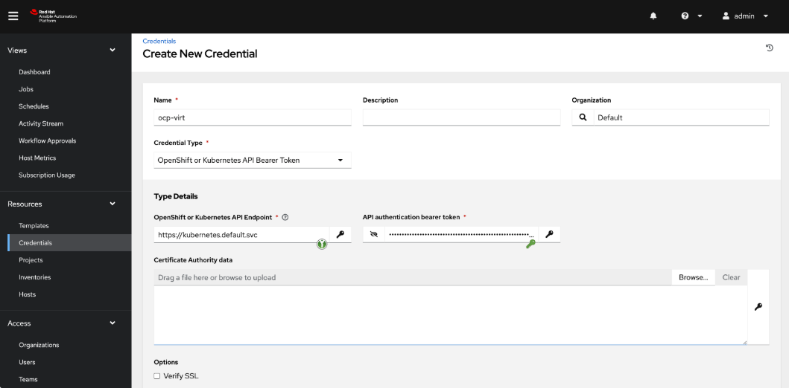

# argocd_ansible_ocpv
Provision vm's with ArgoCD and Ansible in OpenShift Virtualization

# ansible collections for VM management in OpenShift virtualization

[Red Hat Ansible Automation Platform - Certified & supported content](https://console.redhat.com/ansible/automation-hub/repo/published/redhat/openshift_virtualization/) 


[AWX - Upstream & Community based support](https://kubevirt.io/kubevirt.core/1.0.0/README.html) 

# In this repo you have: 

1. RHEL image creation and how to create an OpenShift Virt boot source of that image [here](https://github.com/johanodell/argocd_ansible_ocpv/tree/main/ansible_bootsource_creation)

2. Example of Ansible inventory for OpenShift Virt [here](https://github.com/johanodell/argocd_ansible_ocpv/tree/main/ansible_inventory)

3. How to use ArgoCD and Ansible for a provisioning workflow [here](https://github.com/johanodell/argocd_ansible_ocpv/tree/main/gitops)

4. Some ansible playbooks for provisioning VMs [here](https://github.com/johanodell/argocd_ansible_ocpv/tree/main/gitops)


# For this to work we need to connect AAP with OCP and vice versa

First we need a credential. This token should be scoped but for now let's just add a cluster-admin scoped token. In your AWX/AAP namespace. 

1. Add a ServiceAccount:  ```oc create sa awx-credential ```

2. Add cluster-admin rights to the service account: ```oc adm policy add-cluster-role-to-user cluster-admin -z controller-credential```
   
3. Create a token for the SA: ```oc create token awx-credential --duration=4294967296s``` (😱 very long time). 
Copy it and add it as a Credential in the controller:



4. To be able to use CRDs to manage and run AAP/AWX you need to connect the resource operator to the automation controller:

    a. In the AAP/AWX navigation panel, select Access Users.

    b. Select the username you want to create a token for.

    c. Click on Tokens, then click Add. Copy the token.

    d. You can leave Applications empty. Add a description and select Read or Write for the Scope.

Add a secret with the token:

```yaml 
oc apply -f - <<EOF
apiVersion: v1
kind: Secret
metadata:
  name: controller-access
  namespace: aap
type: Opaque
stringData:
  token: <generated-token>
  host: https://<my-controller-host.example.com>
EOF
```

This secret needs to be referenced in your AAP/AWX manifests as in the below example.

```yaml
---
apiVersion: tower.ansible.com/v1alpha1
kind: AnsibleWorkflow
metadata:
  name: gitops-post-configuraiton-workflow
  namespace: aap
  annotations:
    argocd.argoproj.io/sync-wave: "1"
spec:
  extra_vars: # Extra variables prompt on launch needs to be enabled in AAP/AWX
    vm_name: rhel9-gitops1-1
  connection_secret: controller-access
  workflow_template_name: "gitops-post-configuraiton-workflow"
  inventory: mothershift # Inventory prompt on launch needs to be enabled in AAP/AWX
```
[Here](https://github.com/ansible/awx-resource-operator/tree/devel/config/samples) you can see more manifest examples for the resource operator, such as credentials, projects, jobtemplates etc. 
