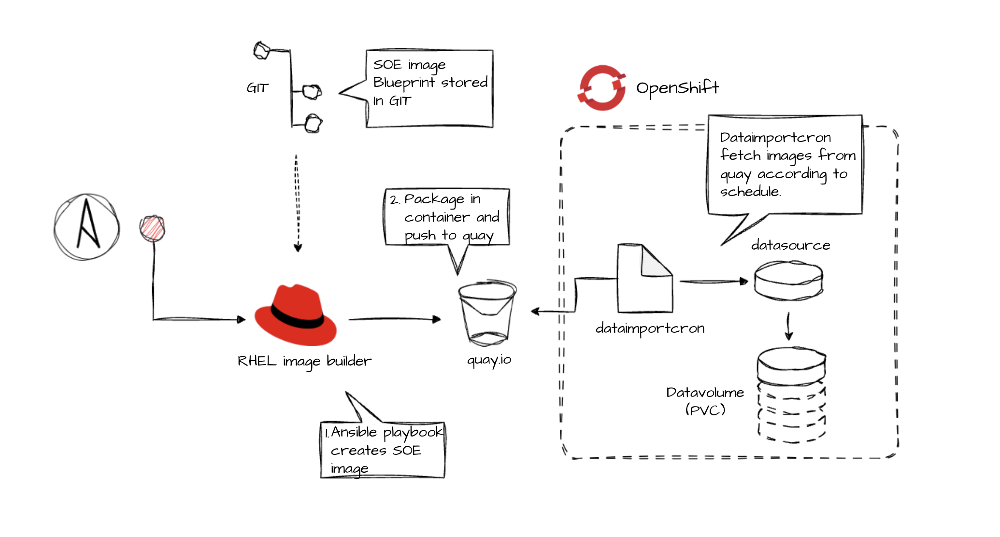

# Here is how you can create your own RHEL images

In this folder you have playbooks to automate the creation 
of RHEL images for OCP Virt using Ansible. 
The examples here are built for AWX so i have been using [Marko Myllinens Image builder Role](https://github.com/myllynen/rhel-image).  

As explained in the picture you use a playbook and run against a 
RHEL server to create a RHEL image. In this case the playbook called
image_builder.yaml

When it has been run you will wrap the qcow2 file in an
OCI compliant container image and push it to quay.io with the playbook
push_image_2_quay.yaml 




Now you have the image in quay. To get a boot source in OpenShift 
you can setup a DataImportCron that will download your updated RHEL
image according to your update frequenzy. Here is an example that 
fetches your image every saturday and updates OCP Virt with a freshly built 
RHEL image. 

```yaml
apiVersion: cdi.kubevirt.io/v1beta1
kind: DataImportCron
metadata:
  name: <your image name>
  namespace: openshift-virtualization-os-images
spec:
  schedule: "0 0 * * 6"
  managedDataSource: <your datasource name>
  template:
    spec:
      source:
        registry:
          url: <docker://quay.io/therest/ofyourpath>
      storage:
        resources:
          requests:
            storage: 30Gi
  garbageCollect: Outdated
  importsToKeep: 3
  storageClassName: <your storageclass to use>
  volumeMode: Block
  Source Format: pvc
  ```