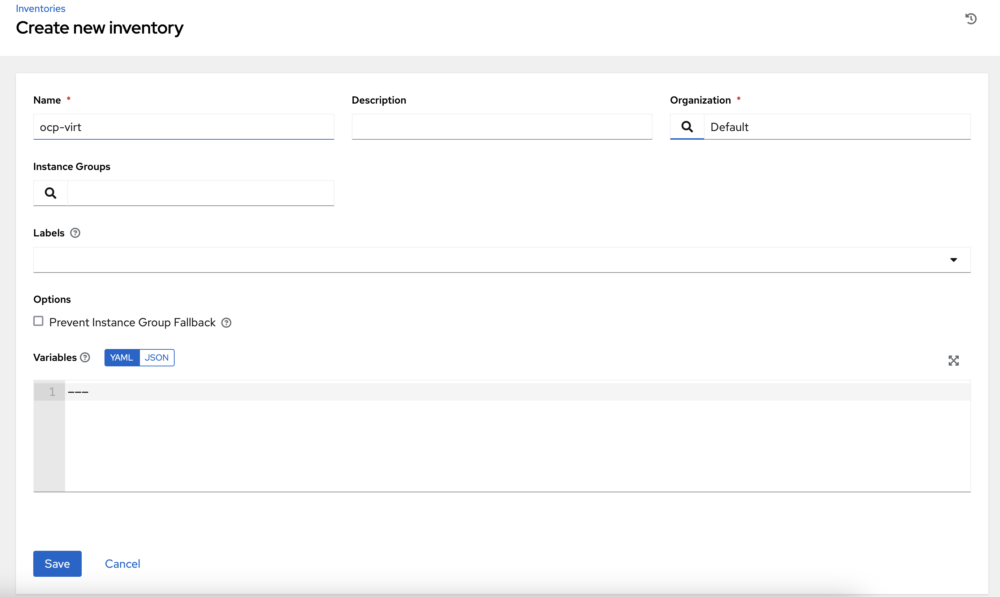
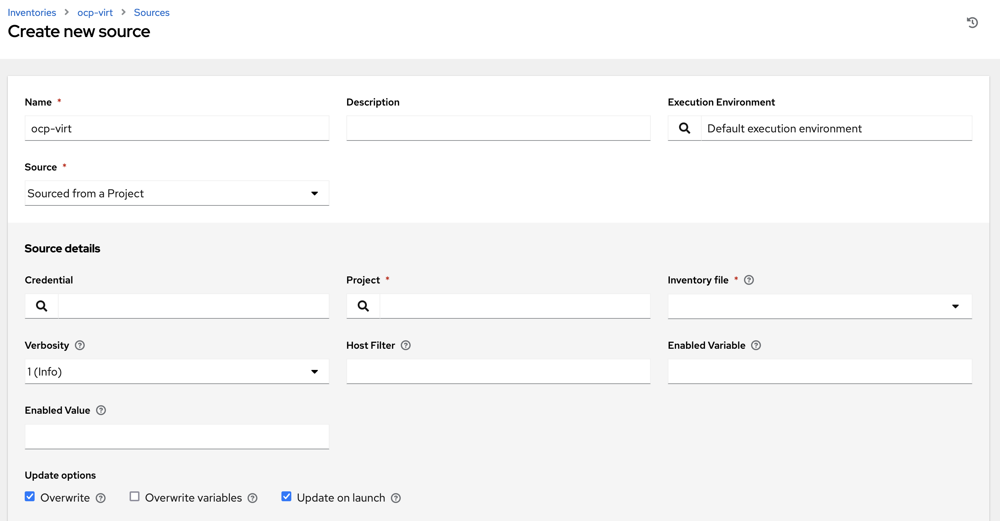

# How to setup OpenShift Virt inventory in AWX / AAP

1. First you will need to create a project in your AWX / AAP controller pointing 
to a git repo where you store your inventory yaml file. If you followed the repo README and connected the resource operator to AWX / AAP you can do that according to below. 

```yaml
oc apply -f - <<EOF
apiVersion: tower.ansible.com/v1alpha1
kind: AnsibleProject
metadata:
  name: # add your name
  namespace: aap
spec:
  repo: https://github.com/<your-path>/to-repo> # add your repo
  branch: main
  name: # add your name
  scm_type: git
  organization: Default
  description: 'OCP Virt inventory project' # add your description
  connection_secret: <controller-access> # your secret name goes here
  runner_pull_policy: IfNotPresent
EOF
```

2. Create an inventory



3. create an inventory source



Fill in relevant credential (for your openshift), path to your inventory.kubevirt.yaml and the name of the project created above in step 1. 
