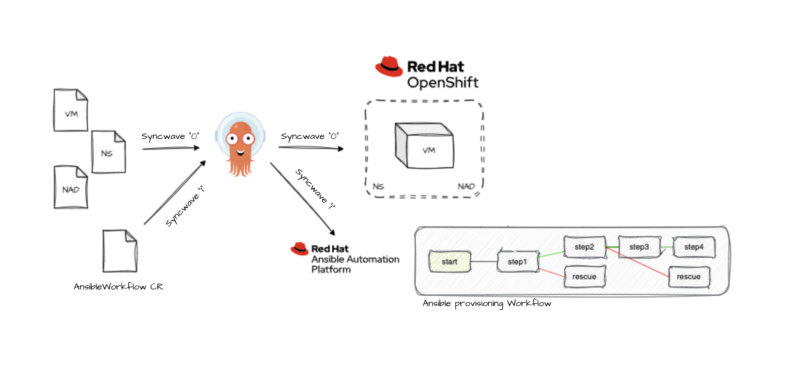

# GitOps repo

Prereqs: 

You need to have the following operators installed on the same cluster: 
- Openshift GitOps
- nmstate operator
- Ansible Automation Platform or AWX
- OpenShift Virtualization 

In my example i have configured a linux bridge where i put my VM on both the pod network and my secondary network provided by the linux bridge and multus. If you dont have that setup you can alter my examplefiles. 

Then you need to remove the NetworkAttachementDefinition.yaml from the base/kustomization.yaml file
and clean up the rhel9.yaml file from the extra network and extra interface. 

Here you can see a [demo video](https://www.youtube.com/watch?v=VzjX9drS2lw) from where theese files have been used to run through the secnario.